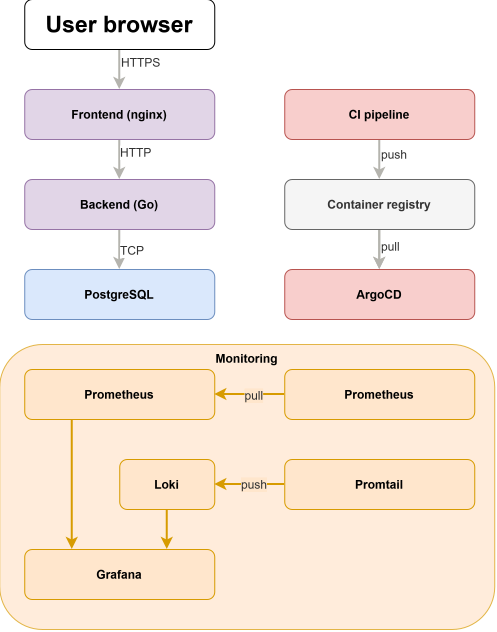

# Infrastructure Analysis Report

## 1. Overview

This report documents the infrastructure analysis for a sample application, a web application consisting of a frontend,
Go backend, and PostgreSQL database. The analysis covers resource metrics collected under controlled load testing
conditions, service dependencies, data flows, security requirements, and infrastructure specifications for cloud
migration.

The monitoring stack runs as a separate Docker Compose deployment and includes Grafana, Prometheus, Loki, Promtail, and
a Postgres exporter. CI/CD is handled by ArgoCD for continuous deployment.

---

## 2. Performance Baseline

### 2.1 Metric Collection Approach

Metrics were collected using the following tooling:

- **docker-stats-exporter** - per container CPU, RAM, and network IO via the Docker API.
- **node-exporter** - host-level disk IO and filesystem metrics.
- **postgres-exporter** - PostgreSQL specific metrics including active connections, transactions per second, and
  database size.
- **Loki + Promtail** - log aggregation.

Load was simulated using Locust with a realistic user flow: register, login, check session, logout and re-login, and
failed login attempts. Traffic was sent through the nginx frontend, which proxies requests to the backend.

Testing was conducted at lower than expected user counts due to identified bottlenecks described in later.

### 2.2 CPU Usage

| Component             | Average CPU | Peak CPU |
|-----------------------|-------------|----------|
| Frontend (nginx)      | <1%         | <1%      |
| Backend (Go/Fiber)    | 5%          | 10%      |
| PostgreSQL            | 10%         | 30%      |
| Prometheus            | 1-2%        | 3%       |
| Grafana               | 2-3%        | 5%       |
| Loki                  | 1-2%        | 3%       |
| Promtail              | <1%         | 1%       |
| Postgres exporter     | <1%         | <1%      |
| docker-stats-exporter | <1%         | <1%      |
| node-exporter         | <1%         | <1%      |

PostgreSQL was the most CPU-intensive component, peaking at 30% during write-heavy operations (user registration). The
backend spiked during concurrent request handling but stayed well within single-core limits during stable operation.

### 2.3 Memory Usage

| Component             | Average RAM | Peak RAM |
|-----------------------|-------------|----------|
| Frontend (nginx)      | 9MB         | 12MB     |
| Backend (Go/Fiber)    | 7MB         | 15MB     |
| PostgreSQL            | 40MB        | 90MB     |
| Prometheus            | 60MB        | 90MB     |
| Grafana               | 200-300MB   | 300MB+   |
| Loki                  | 100MB       | 130MB    |
| Promtail              | 15MB        | 20MB     |
| Postgres exporter     | 10MB        | 15MB     |
| docker-stats-exporter | 10MB        | 15MB     |
| node-exporter         | 20MB        | 25MB     |

Grafana is the largest memory consumer in the monitoring stack. Memory usage scales with the number of open dashboards
and active panel queries. The 200-300MB figure reflects normalized single-dashboard operation. Prometheus and Loki
memory grows over time as data accumulates in the write-ahead log before being flushed to disk blocks.

Total observed memory across all components: approximately 600-800MB under stable load.

### 2.4 Network Traffic

| Component                | Receive  | Transmit |
|--------------------------|----------|----------|
| Frontend (nginx)         | ~20 KB/s | ~20 KB/s |
| Backend (Go/Fiber)       | ~15 KB/s | ~15 KB/s |
| PostgreSQL               | ~5 KB/s  | ~5 KB/s  |
| Monitoring stack (total) | ~10 KB/s | ~10 KB/s |

Traffic volumes are low due to the application's simple auth-only workload. The frontend handles all external traffic
and proxies API requests internally. Database traffic is minimal as queries return small payloads (user records, session
tokens).

At peak load before degradation (~20 concurrent users, ~4 RPS stable):

- External traffic through nginx: ~80 KB/s
- Internal backend-to-database traffic: ~20 KB/s
- Monitoring scrape traffic (Prometheus pulling metrics): ~10 KB/s every 15 seconds

### 2.5 Database Metrics

| Metric                                   | Value                            |
|------------------------------------------|----------------------------------|
| Active connections at baseline           | 20-26                            |
| Transactions per second (stable load)    | ~6 TPS                           |
| Database size growth rate                | ~0.01 MB per 15 registered users |
| Query response time (GET /api/session)   | 2-12ms                           |
| Query response time (POST /api/login)    | 49-89ms                          |
| Query response time (POST /api/register) | 57-87ms                          |

The Postgres exporter maintains approximately 25 persistent idle connections. Application connections are opened on top
of this baseline.

### 2.6 Storage

- **Prometheus**: In memory logging grows at approximately 1MB per 5 minutes during active scraping. Storage blocks are
  written every
  2 hours by default.
- **Loki**: Log ingestion rate of approximately 1-5 KB/s under normal application load.
- **PostgreSQL**: Minimal growth during testing. In production with 1000 active users, storage growth would scale with
  registration and session activity.

---

## 3. Performance Bottlenecks

### 3.1 Database Connection Pool

The most significant bottleneck identified is the absence of database connection pool limits in the backend. The
relevant code in `packages/db/db.go`:

With these limits, Go's `database/sql` package opens connections on
demand with no cap. Under concurrent load, the backend spawns connections faster than they are released, and Postgres
begins queuing or refusing new connections.

Observations:

- Above approximately 20-25 concurrent users, POST requests (login, register) begin timing out
- GET requests continue working normally as they hit cached session data
- Breaking point: ~6 RPS sustained before degradation begins
- At 50+ concurrent users: near 100% POST failure rate, 60-second timeouts

This is the primary scaling limitation of the application when deployed. The fix in a cloud environment would be a
connection pooler sitting between
the backend pods and the database.

### 3.2 No Horizontal Scaling

The application runs as a single instance of each component with no load balancing at the application layer. All traffic
routes through a single nginx process, a single Go backend process, and a single PostgreSQL instance.

### 3.3 Monitoring Resource Usage

Grafana is memory heavy relative to the application components. In a production Kubernetes deployment this needs to be
accounted for when sizing the monitoring node group.

---

## 4. Service Dependencies

### 4.1 Dependency Map

### 4.2 Direct Dependencies

| Service           | Depends On     | Type               |
|-------------------|----------------|--------------------|
| Frontend          | Backend        | HTTP proxy (/api/) |
| Backend           | PostgreSQL     | TCP (port 5432)    |
| Prometheus        | All exporters  | HTTP scrape        |
| Grafana           | Prometheus     | HTTP query         |
| Grafana           | Loki           | HTTP query         |
| Promtail          | Loki           | HTTP push          |
| Postgres exporter | PostgreSQL     | TCP (port 5432)    |
| ArgoCD            | Kubernetes API | HTTPS              |
| GitLab runners    | Kubernetes API | HTTPS              |

### 4.3 Shared Resources

| Resource           | Used By                                          |
|--------------------|--------------------------------------------------|
| Container Registry | GitLab CI (push), both K8s clusters (pull)       |
| GitLab             | CI pipelines for both test and prod environments |
| Docker network     | All application and monitoring containers        |
| PostgreSQL         | Backend, Postgres exporter                       |

---

## 5. Data Flow and Network Analysis

### 5.1 Data Flow Map

### 5.2 Traffic Volumes by Operation

| Operation                        | Direction             | Approximate Volume                      |
|----------------------------------|-----------------------|-----------------------------------------|
| User login (POST /api/login)     | Inbound               | ~500 bytes request, ~500 bytes response |
| Session check (GET /api/session) | Inbound               | ~200 bytes request, ~400 bytes response |
| Container image push (CI/CD)     | Outbound to registry  | ~50-200MB per build                     |
| Container image pull (deploy)    | Inbound from registry | ~50-200MB per deployment                |
| Prometheus scrape                | Internal              | ~5 KB per scrape, every 15 seconds      |
| Log ingestion (Promtail -> Loki) | Internal              | ~1-5 KB/s at normal load                |

### 5.3 Latency-Sensitive Relationships

- **Backend → PostgreSQL**: All API endpoints depend on synchronous database queries. Any latency increase in this path
  directly impacts API response times. Currently, 2-12ms for reads, 49-89ms for writes.
- **Frontend → Backend**: Nginx proxy adds negligible latency.

### 5.4 Peak Hour Network Usage

During peak load testing (~20 concurrent users):

- External inbound: ~40 KB/s
- Internal (backend to DB): ~10 KB/s
- Monitoring traffic: ~5 KB/s

At 1000 simultaneous users as required in production, network traffic would scale roughly linearly with request volume,
assuming the connection pool bottleneck is resolved. Estimated external traffic at 1000 users: ~4 MB/s.

---

## 6. Security Requirements

### 6.1 Authentication and Access

**Service-to-service authentication:**

- Backend authenticates to PostgreSQL using username/password credentials stored in environment variables
- JWT tokens used for user session authentication, signed with a shared secret (`JWT_KEY`)

**User access management:**

- Role based access control (RBAC) required for Kubernetes clusters

**IAM requirements:**

- Separate AWS accounts / GCP projects per environment (test, prod)
- Separate account/project for shared resources (Container Registry, GitLab VM)
- Instance profiles / workload identity for pod-level cloud API access

### 6.2 Networking

**Encryption in transit:**

- TLS certificates required for all public-facing endpoints
- Internal service communication within the cluster can use HTTP
- Certificate management with Let's Encrypt

**Firewall and security groups:**

- Public access only to the external load balancer
- Backend, database, and monitoring components must be in private subnets
- No public IPs on cluster nodes
- Database accessible only from backend pods (security group / firewall rule)
- Monitoring components accessible only via internal load balancer

**Load balancing:**

- External load balancer for public services (frontend)
- Internal load balancer for private services (Prometheus, Grafana, ArgoCD)

**DNS:**

- Public DNS zone for frontend and any public facing services
- Domain registered via any registrar

### 6.3 Cloud Security Mechanisms

| Mechanism                        | Purpose                                            |
|----------------------------------|----------------------------------------------------|
| private subnets                  | Network isolation for backend, DB, monitoring      |
| Security groups / firewall rules | Port access control between components             |
| IAM roles and service accounts   | Access to cloud APIs                               |
| TLS/HTTPS                        | All external traffic                               |
| Private container registry       | Prevent unauthorized image access                  |
| Secrets management               | Store DB passwords, JWT keys outside env variables |
| Audit logging                    | AWS/GCP solutions for API activity tracking        |

---

## 7. Infrastructure Specifications

### 7.1 Environments

Three separate cloud accounts/projects are required:

| Environment | Purpose                                |
|-------------|----------------------------------------|
| test        | Development and testing workloads      |
| prod        | Production workloads, HA configuration |

### 7.2 Kubernetes Infrastructure

**Cluster requirements:**

| Requirement       | Test                 | Prod                 |
|-------------------|----------------------|----------------------|
| Cluster type      | AWS/GCP K8s services | AWS/GCP K8s services |
| High availability | No                   | Yes                  |

**Node groups/pools:**

Each environment requires three separate node groups with horizontal pod autoscaling enabled:

| Node Group | Workloads                                      | Test Size                 | Prod Size                            |
|------------|------------------------------------------------|---------------------------|--------------------------------------|
| main       | Frontend, Backend                              | 1-2 nodes, small instance | 2-4 nodes, medium instance, multi-AZ |
| monitoring | Grafana, Prometheus, Loki, Promtail, exporters | 1 node, small instance    | 2 nodes, medium instance             |
| tools      | ArgoCD, External DNS, GitLab K8s Runners       | 1 node, small instance    | 1-2 nodes, small instance            |

**Kubernetes storage:**

- Persistent volumes required for Prometheus data, Loki data, Grafana data

### 7.3 Database

| Requirement            | Test                    | Prod                      |
|------------------------|-------------------------|---------------------------|
| Engine                 | PostgreSQL 17           | PostgreSQL 17             |
| Type                   | Managed                 | Managed                   |
| High availability      | No                      | Yes                       |
| Instance size          | Small (2 vCPU, 4GB RAM) | Medium (4 vCPU, 16GB RAM) |
| Storage                | 20GB SSD                | 100GB SSD, autoscaling    |
| Encryption at rest     | Yes                     | Yes                       |
| Daily backups          | Yes (7 day retention)   | Yes (30 day retention)    |
| Point-in-time recovery | No                      | Yes (7 days of WAL logs)  |
| Private access only    | Yes                     | Yes                       |

### 7.4 Container Registry

- Private registry per environment or shared across environments
- Images stored: frontend, backend
- Encryption at rest required
- Access via IAM roles only (no public access)

### 7.5 Monitoring

| Component  | Retention | Notes                           |
|------------|-----------|---------------------------------|
| Prometheus | 30 days   | Application metrics             |
| Loki       | 1 year    | Application logs                |
| Grafana    | N/A       | Stateless, config in ConfigMaps |

Managed monitoring services are not permitted. All monitoring
components run as self-managed deployments in the monitoring node group.

Each environment has its own isolated monitoring stack.

### 7.6 CI/CD

**GitLab:**

- Self-managed GitLab on a VM in the shared account/project
- VM size: 2 vCPU, 4GB RAM minimum
- Storage: 50GB for repositories and artifacts

**GitLab Runners:**

- Self-managed Kubernetes runners deployed in the tools node group
- One runner deployment per environment

**ArgoCD:**

- Deployed in the tools node group per environment
- Watches the GitLab repository for Helm chart changes
- Syncs deployments to the respective Kubernetes cluster

### 7.7 Storage Summary

| Storage Type       | Component                 | Size Estimate       |
|--------------------|---------------------------|---------------------|
| Persistent volume  | Prometheus (per env)      | 50GB                |
| Persistent volume  | Loki (per env)            | 200GB (1 year logs) |
| Persistent volume  | Grafana (per env)         | 5GB                 |
| Managed database   | PostgreSQL (test)         | 20GB                |
| Managed database   | PostgreSQL (prod)         | 100GB               |
| Container registry | Frontend + Backend images | 5-20GB              |
| Object storage     | Log archives / backups    | Variable            |

---

## 8. Scaling Requirements

At the target of 1000 simultaneous active users in production, the following scaling considerations apply:

**Backend:** The connection pool bottleneck must be resolved before horizontal scaling is effective. With
a connection pooler in place, the backend can scale horizontally. Estimated minimum: 2-3 pods with HPA
configured to scale on CPU load.

**Database:** A larger managed instance is required when compared to the local setup. Read replicas may be considered if
read
traffic dominates (session checks are the most frequent operation).

**Monitoring:** Prometheus and Loki storage requirements grow with the number of pods being monitored and log volume. At
1000 users generating continuous activity, log volume will be significantly higher than measured locally.

**Frontend:** nginx is stateless and lightweight. Minimal scaling required, only for redundancy considerations.